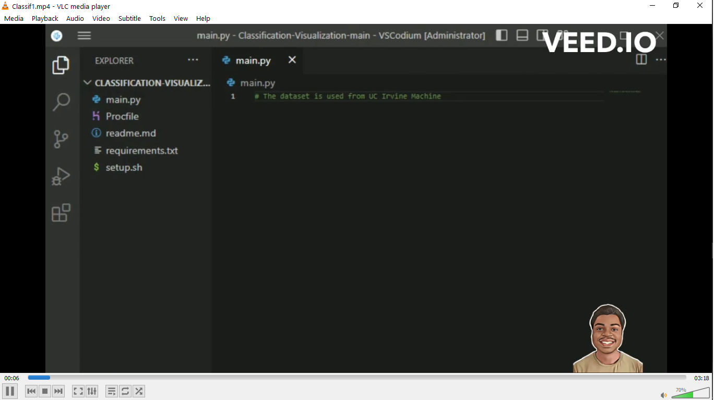
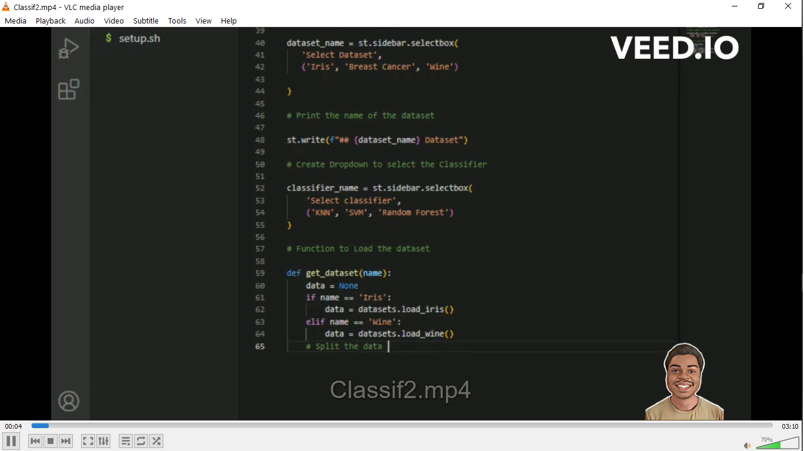
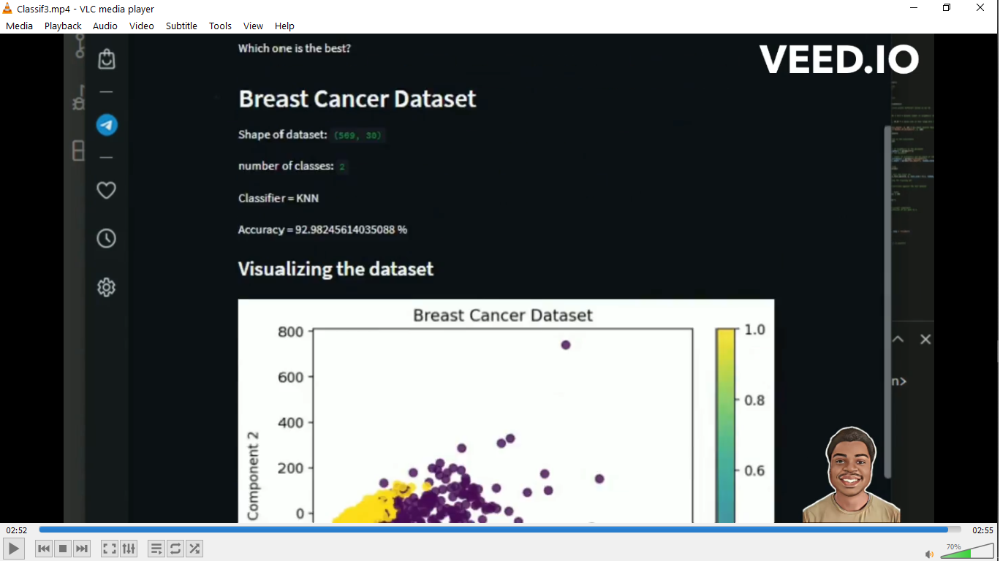

# Interactive Web App with Streamlit and Scikit-learn that applies different Classification algorithms to popular datasets

Datasets Used: Iris dataset, Breast Cancer Dataset and Wine Dataset from UC Irvine Machine Learning Repository

## Preview


 

 

 

## Installation
You need these dependencies:
```console
pip install streamlit
pip install scikit-learn
pip install matplotlib
```

## Usage

Run
```console
streamlit run main.py
```
